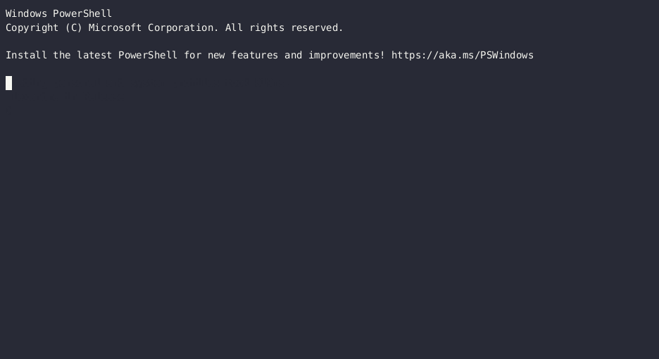
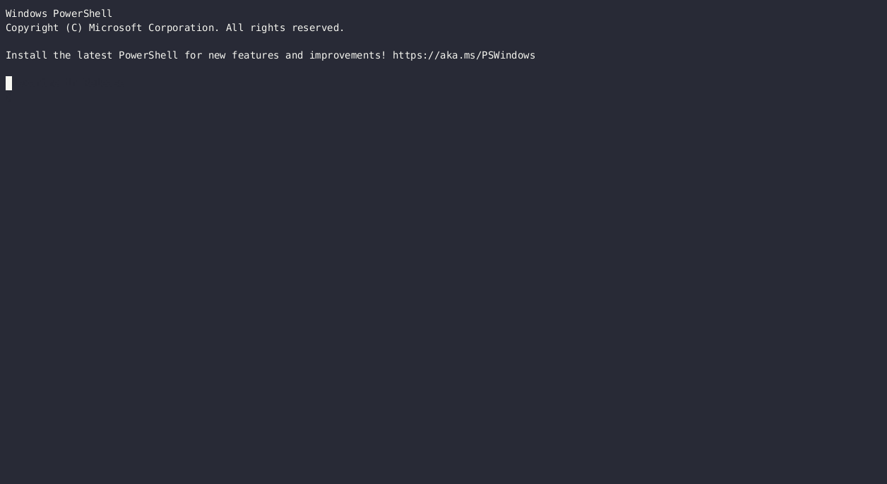

# yara-ttd - _The ultimate packer nemesis_

**Use YARA rules on Time Travel Debugging traces :hourglass_flowing_sand:**

**[Watch `yara-ttd` introduction during @atxr 's rump at SSTIC 2023 (french only :baguette_bread:)](https://static.sstic.org/rumps2023/SSTIC_2023-06-08_P12_RUMPS_17.mp4)**

1. [Demo](#demo)
2. [Motivations](#motivations)
3. [Install](#install)
4. [Usage](#usage)
5. [Upcoming features](#upcoming-features)

## Demo

#### A binary packed with UPX

A simple binary that launches calc.exe, packed with [UPX](https://upx.github.io).
_yara-ttd_ finds the `calc.exe` string in the module memory, during a thread creation.



#### A simple obfuscated shellcode that runs `calc.exe`

The tested binary decrypts a shellcode, and runs it in a new thread.
_yara-ttd_ manages to find the `calc.exe` string on the heap when hooking on the `ntdll!NtCreateThreadEx` function.



## Motivations

### YARA

[YARA](https://virustotal.github.io/yara/) is a powerful pattern matching tool for binaries.

> YARA is a tool aimed at (but not limited to) helping malware researchers to identify and classify malware samples. With YARA you can create descriptions of malware families (or whatever you want to describe) based on textual or binary patterns.
>
> -- <cite>[YARA documentation](https://virustotal.github.io/yara/)</cite>

Thanks to YARA, we can save a lot of time by automatically classifying malware samples in a pipeline before analyzing them.

### Packers

Unfortunately, most malware samples are protected with different kinds of **packers**. A classical runtime-packer scheme like [UPX](https://upx.github.io/) or [VMProtect](https://vmpsoft.com/) consists of self-extracting and running obfuscated and sometimes encrypted code.
Therefore, YARA cannot deal with packed binaries because it won't find any matches in the packed code.

### Time Travel Debugging

[Time Travel Debugging](https://learn.microsoft.com/en-us/windows-hardware/drivers/debugger/time-travel-debugging-overview) - or TTD - is a feature of the native Windows debugger WinDbg.

> Time Travel Debugging is a tool that allows you to capture a trace of your process as it executes and then replay it later both forwards and backwards. Time Travel Debugging (TTD) can help you debug issues easier by letting you "rewind" your debugger session, instead of having to reproduce the issue until you find the bug.
>
> -- <cite>[Microsoft documentation](https://learn.microsoft.com/en-us/windows-hardware/drivers/debugger/time-travel-debugging-overview#what-is-time-travel-debugging)</cite>

For malware analysis, TTD is a powerful tool because it allows recording the trace of a malware in a sandbox. Hence, we can safely replay and share the recorded file outside of the sandbox to analyze the malware.
Also, TTD is not a debugger, so it won't be detected by classical anti-debuggind techniques such as `PEB.BeingDebugged`.
For a deeper analysis of TTD from a security point of view, check this article: [Deep dive into the TTD ecosystem](https://www.elastic.co/security-labs/deep-dive-into-the-ttd-ecosystem)

Of course, TTD is a proprietary software, and this work could not exist without the [ttd-bindings developped by commial](https://github.com/commial/ttd-bindings).

### yara-ttd

The idea behind `yara-ttd` is to use the trace files recorded by TTD with `yara` itself to defeat packers.

Because `yara` cannot scan the packed binary itself, `yara-ttd` provides a way to analyze the trace file that contains all the runtime information, including the unpacking process.

With `yara-ttd`, you can select a set of positions in the trace file where you want to scan the memory with your yara rules.
Hence, you can hook the packed binary wherever you want with your yara rules!

`yara-ttd` provides several memory scanning strategies, like when modules are loaded, or when virtual memory is allocated, that are often used to store the malware code once it has been unpacked.

## Install

For now, `yara-ttd` only supports Windows, because it needs to interact with the TTD API.

First build the project:

```bash
mkdir build
cd build
cmake ..
cmake --build .
```

Then, add the `TTDReplay.dll` and `TTDReplayCPU.dll` files in the same directory as the executable.
You will find these DLL files in `%LocalAppData%\Microsoft\WindowsApps\Microsoft.WinDbg_X\TTD`

## Usage

First you need to record a trace (`.run` file) of your program.
For a detailed help about how to record a TTD trace, see [this tutorial](https://github.com/airbus-cert/ttddbg/blob/main/HOWTO_TIME_TRAVEL.md).

Then simply run:

```
.\yara-ttd path\to\rule path\to\trace\file
```

### Memory modes

There are three modes to scan memory:

- Mode 0 (default): Loaded Module Memory
- Mode 1: Virtual Allocated memory + Loaded Module Memory
- Mode 2: Full memory (can be very long)

You can select the mode with `-m`:

```
.\yara-ttd -m 1 path\to\rule path\to\trace\file
```

Like the official _yara_ CLI, you can use the `-s` flag to print the details of the matches, like the memory address and the exact subrule which matched.

##### Notes on Virtual Allocated mode:

Because TTD doesn't store the memory structure, `yara-ttd` computes before the scan the structure of the heap addresses for each time position.
It will create a cache file with the extenstion `.tmp` in the same path as the trace file to store the heap structure.
If you want to rerun yara-ttd on a trace and load the heap structure from the generated cache file you can simply do:

```bash
.\yara-ttd -m 1 --cache=path\to\cache\file path\to\rule path\to\trace\file
```

##### Note on full memory mode:

We can access the full memory range of a process with TTD, which corresponds to the min and max address returned by `GetSystemInfo`. Nevertheless, most of the time, this range is too important to be scanned without any optimisation.

### Time modes

The default time positions that will be scanned are:

- Exception events
- Module loaded events
- Thread created events

With the flag `-t` and `-f`, you can select other positions or function calls to scan:

```bash
.\yara-ttd -m 1 -t 3C1:A -t 5FF:22 -f ntdll!FreeVirtualMemory -f ntdll!NtCreateThreadEx path\to\rule path\to\trace\file
```

The `-t` flag expects TTD positions in the form `major:minor` (both in hexadecimal, without `0x`).
The `-f` flag expects a string in the form `module_name!function_name`.

You can also add all the functions you want to hook in a file:

```bash
> cat .\functions.txt
ntdll!FreeVirtualMemory
ntdll!NtCreateThreadEx

> .\yara-ttd -m 1 -F functions.txt path\to\rule path\to\trace\file
```

### Scan multiple trace files

If you have multiple files to scan with `yara-ttd`, you can also scan a whole directory.
`yara-ttd` will ignore all the following extensions in the folder:

- `.tmp` (cache files generated by `yara-ttd`)
- `.idx` (index files generated by `ttd`)
- `.err` (error files generated by `ttd`)
- `.out` (log files generated by `ttd`)

In the following example, `yara-ttd` will scan the files `trace01.run` and `trace02.run` only.

```bash
> dir .\traces
trace01.run
trace01.out
trace01.idx
trace02.run
trace01.run.err
trace01.tmp

> .\yara-ttd path\to\rule .\traces
```

Alternatively, you can specify all the traces you want to scan in a file and use the flag `--scan-list` or `-l`. It will scan the files listed, one per line:

```bash
> cat .\scan_me.txt
.\traces\trace01.run
.\traces\trace02.run

> .\yara-ttd -l path\to\rule .\scan_me.txt
```

> When scanning multiple files, `yara-ttd` runs scans one after the other, and not simultaneously with threading like the original `yara` cli.

## Upcoming features

- libyarattd with Python bindings
- Link with [ttddbg](https://github.com/airbus-cert/ttddbg) and IDA: feature that loads IDA at the end of the scan at the position of the match in time and memory
- TTD: Follow child when forking the process
